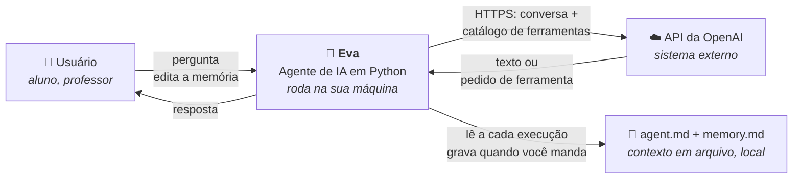
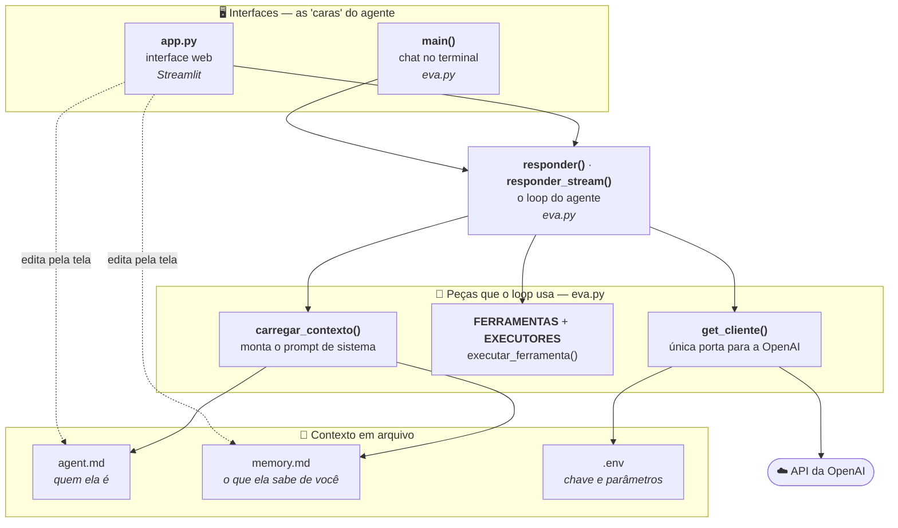
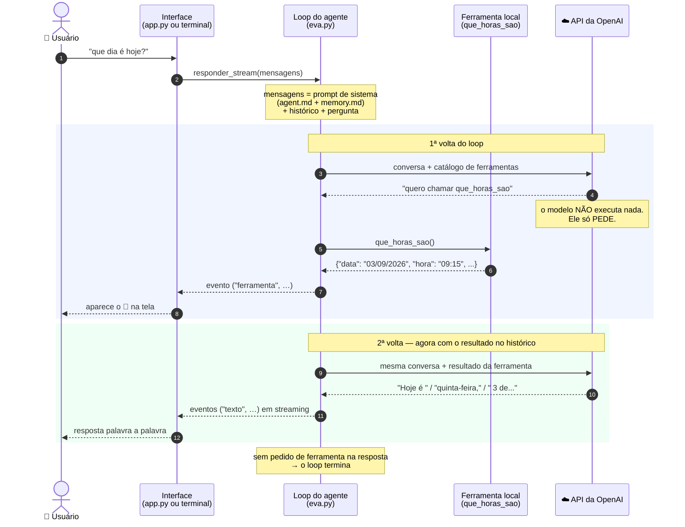

# Eva — guia do projeto

Material de apoio para quem está começando. Explica **o que** é o projeto,
**por que** cada arquivo existe, e **como** rodar nas duas versões: console e web.

> **Como ler este guia:** o fluxo principal assume que você já programa. As
> partes de ambiente (venv, PowerShell, `.env`) estão em blocos recolhíveis
> — abra só se precisar.
>
> **Os diagramas** são Mermaid (código, não imagem). Aparecem desenhados no
> GitHub e no GitLab sem configuração nenhuma. No VS Code, o preview padrão do
> Markdown **não** renderiza Mermaid — instale a extensão *Markdown Preview
> Mermaid Support*. Sem isso você vê o código-fonte do diagrama, que também é
> legível, mas não é a mesma coisa.

---

## 1. O objetivo do projeto

Construir um **agente de IA** do zero, em Python, e entender cada peça.

Não é um chatbot embrulhado numa biblioteca mágica. São ~300 linhas que você
consegue ler inteiras, com o objetivo de tornar visível o que normalmente fica
escondido dentro de um framework.

**A pergunta que o projeto responde:** o que exatamente diferencia um agente de
uma simples chamada de API?

```
Chamada de API:   pergunta ─────────────► resposta

Agente:           pergunta ──► modelo ──► "preciso da ferramenta X"
                                  ▲                    │
                                  │                    ▼
                                  └──── resultado ── seu código executa
                                                          │
                                              (repete até o modelo
                                               responder em texto)
```

Esse ciclo é o **loop do agente**. É a única ideia realmente nova aqui — todo o
resto (ler arquivo, montar prompt, imprimir na tela) é programação comum.

### O que a Eva faz hoje

Conversa em português, lembra de você entre execuções (via `memory.md`) e sabe
consultar a data e a hora — que é justamente o tipo de coisa que um modelo de
linguagem **não sabe** e precisa perguntar para uma ferramenta.

É pouco de propósito. O projeto foi feito para crescer aos poucos.

---

## 2. Como começar um projeto assim

A ordem abaixo vale para praticamente qualquer projeto Python, não só este.

### 2.1 Uma pasta por projeto

```
C:\Projetos\Eva\
```

Nada de trabalhar direto na Área de Trabalho ou em `Downloads`. Pasta própria,
nome sem espaço nem acento — vai te poupar horas de dor de cabeça com caminhos.

### 2.2 Um ambiente virtual (venv)

Um venv é uma pasta com um Python isolado só para este projeto. Sem ele, todos
os seus projetos disputam as mesmas versões de biblioteca — e um dia um quebra o
outro.

<details>
<summary><b>Passo a passo do venv (abra se você é novo nisso)</b></summary>

**Windows PowerShell:**

```powershell
cd C:\Projetos\Eva
python -m venv .venv
.\.venv\Scripts\Activate.ps1
```

Deu certo quando o prompt vira `(.venv) PS C:\Projetos\Eva>`.

Dois erros muito comuns:

- **`O token '&&' não é um separador de instruções válido`** — o PowerShell do
  Windows (5.1) não aceita `&&`. Isso é sintaxe do `cmd` e do PowerShell 7+. Use
  um comando por linha.
- **`não pode ser carregado porque a execução de scripts foi desabilitada`** —
  libere só para esta janela, não muda nada permanente:

  ```powershell
  Set-ExecutionPolicy -Scope Process -ExecutionPolicy Bypass
  .\.venv\Scripts\Activate.ps1
  ```

**Linux / macOS:**

```bash
cd ~/projetos/Eva
python -m venv .venv
source .venv/bin/activate
```

Para sair do venv, em qualquer sistema: `deactivate`.

</details>

### 2.3 Declarar as dependências

Crie um `requirements.txt` com as bibliotecas que o projeto usa e instale a
partir dele — nunca uma a uma na mão. É o que permite outra pessoa (ou você em
outra máquina) reproduzir o ambiente:

```powershell
pip install -r requirements.txt
```

### 2.4 Segredos fora do código

Chave de API **nunca** vai dentro do `.py`. Vai num arquivo `.env`, que fica de
fora do Git.

```
.env.example   → vai para o Git, com valores de exemplo (é a documentação)
.env           → fica só na sua máquina, com os valores reais
```

O `.gitignore` do projeto já cuida disso.

<details>
<summary><b>Configurando o .env deste projeto</b></summary>

```powershell
copy .env.example .env
notepad .env
```

Preencha a `OPENAI_API_KEY` com a chave gerada em
`platform.openai.com/api-keys` e **apague a linha de exemplo**
(`OPENAI_API_KEY=sk-proj-...`). Duas linhas com a mesma variável funcionam por
acidente — a última vence — mas é fonte garantida de bug futuro.

Conteúdo final:

```env
OPENAI_API_KEY=sk-proj-suachaveaqui
OPENAI_MODEL=gpt-4o-mini
EVA_TEMPERATURA=0.7
EVA_MAX_ITERACOES=5
```

</details>

### 2.5 Separar o núcleo da interface

Desde o primeiro dia:

```
eva.py  = o agente        (a lógica: roda no terminal, num teste, num servidor)
app.py  = uma das caras   (Streamlit hoje; amanhã uma API, um bot no WhatsApp)
```

Parece exagero num projeto pequeno. Não é: é exatamente o que permitiu
acrescentar a interface web depois sem reescrever nada do agente.

---

## 3. Diagrama de contexto

Quem conversa com quem, visto de fora. Sem detalhe interno.



**Leitura do diagrama:** tudo roda na sua máquina, menos o modelo. A única saída
para a internet é a chamada à OpenAI — e o que trafega ali é a conversa mais a
lista de ferramentas disponíveis. Nenhum arquivo seu é enviado sem que uma
ferramenta o leia explicitamente.

---

## 4. Diagrama de arquitetura

As peças por dentro e quem depende de quem.



Três coisas para notar:

**As setas só descem.** As interfaces conhecem o núcleo; o núcleo não conhece as
interfaces. Por isso dá para trocar o Streamlit por uma API sem tocar no
`eva.py`.

**O `app.py` não sabe quais ferramentas existem.** Ele só recebe eventos
`("ferramenta", …)` e desenha. Ferramenta nova no `eva.py` aparece na tela
sozinha.

**`get_cliente()` é a única porta para a OpenAI.** Trocar de provedor (Anthropic,
Azure OpenAI, modelo local) começa e quase termina nessa função.

---

## 5. Diagrama de sequência

Um turno completo em que o modelo precisa de uma ferramenta. É o caminho mais
interessante — e o mais mal compreendido.



**O ponto que mais confunde iniciantes** está no passo 5: o modelo não executa
código. Ele devolve um texto dizendo *"quero chamar `que_horas_sao` com estes
argumentos"*. Quem executa é o seu Python, na sua máquina, com as suas
permissões. Isso é ótimo — você controla exatamente o que ele consegue fazer.

**Por que duas voltas:** na primeira, o modelo não tinha a informação. Na
segunda, o resultado da ferramenta já está no histórico da conversa, então ele
consegue responder. O loop repete até o modelo responder sem pedir nada — com um
teto de `EVA_MAX_ITERACOES` para nunca girar para sempre.

---

## 6. Os arquivos, um a um

```
Eva/
├── eva.py               ← o agente
├── app.py               ← a interface web
├── agent.md             ← quem a Eva é
├── memory.md            ← o que ela sabe de você
├── .env                 ← sua chave (não vai para o Git)
├── .env.example         ← modelo do .env (vai para o Git)
├── .gitignore
├── requirements.txt
├── README.md
└── GUIA-DO-PROJETO.md   ← este arquivo
```

### `eva.py` — o agente

Dividido em 5 seções numeradas, na ordem em que as coisas acontecem:

| Seção | O que tem |
|---|---|
| 1. Configuração | Lê o `.env`; `get_cliente()` instancia a OpenAI |
| 2. Contexto | `carregar_contexto()` junta `agent.md` + `memory.md` no prompt de sistema |
| 3. Ferramentas | A função `que_horas_sao`, sua declaração e o registro |
| 4. O loop | `responder()` e `responder_stream()` |
| 5. O chat | `main()`, a versão de terminal |

### `app.py` — a interface web

Só interface. Importa tudo do `eva.py`. Streamlit re-executa este arquivo
inteiro a cada clique, então o que precisa sobreviver mora em
`st.session_state`.

### `agent.md` — a identidade

**Este arquivo *é* o prompt de sistema.** Não é documentação sobre a Eva: é o
texto que vai literalmente para o modelo em toda mensagem, definindo tom, regras
e quando usar cada ferramenta.

Mudar o comportamento dela é editar Markdown, não Python. Esse é o ponto
pedagógico mais importante do projeto.

### `memory.md` — a memória

Lido a cada execução e injetado no prompt. É o que faz a Eva lembrar de você
entre uma sessão e outra. Tem prioridade sobre as suposições dela.

Escreve-se nele de duas formas: `/lembrar <fato>` no terminal, ou pela barra
lateral da interface web.

> **Limite honesto:** este arquivo inteiro entra no prompt a cada mensagem.
> Enquanto for pequeno, tudo bem. Quando crescer, o próximo passo é buscar só os
> trechos relevantes em vez de mandar tudo — é aí que entram *embeddings* e RAG.
> Mas resolver isso antes de ter o problema é otimização prematura.

### `requirements.txt`

Três linhas: `openai`, `python-dotenv`, `streamlit`.

### `.env` e `.env.example`

Segredos e parâmetros. O `.env` fica fora do Git; o `.env.example` é a
documentação de quais variáveis existem.

---

## 7. Como usar — versão console

```powershell
.\.venv\Scripts\Activate.ps1
python eva.py
```

```
Eva — gpt-4o-mini
Digite /ajuda para ver os comandos.

você> que dia é hoje?

eva> Hoje é quinta-feira, 3 de setembro de 2026.
```

### Comandos

| Comando | O que faz |
|---|---|
| `/ajuda` | lista os comandos |
| `/verboso` | mostra as chamadas de ferramenta acontecendo |
| `/lembrar <fato>` | grava um fato em `memory.md` e já reinjeta no prompt |
| `/memoria` | mostra o `memory.md` |
| `/limpar` | esquece a conversa atual (a memória em arquivo continua) |
| `/sair` | encerra |

### O primeiro experimento que vale fazer

```
você> /verboso
[verboso ligado]

você> quantos dias faltam para o Natal?
  [tool] que_horas_sao({})

eva> Faltam 113 dias — hoje é 3 de setembro.
```

Aquela linha `[tool]` é o loop do agente acontecendo na sua frente. O modelo
decidiu sozinho que precisava saber a data antes de conseguir fazer a conta.

Agora pergunte algo que **não** precisa de ferramenta ("o que é uma API?") e
repare que nenhuma linha `[tool]` aparece. Quem decide é o modelo, a partir da
`description` que você escreveu na declaração da ferramenta.

---

## 8. Como usar — versão web

```powershell
.\.venv\Scripts\Activate.ps1
streamlit run app.py
```

Abre em `http://localhost:8501`. Para parar, `Ctrl+C` no PowerShell.

### O que tem na tela

| Onde | O que faz |
|---|---|
| Chat central | Resposta em streaming, palavra a palavra |
| 🔧 acima da resposta | Qual ferramenta rodou, com que argumentos, o que voltou |
| Barra lateral · Modelo | Troca de modelo sem reiniciar |
| Barra lateral · Temperatura | 0 = objetiva e previsível · 1 = criativa e variada |
| Barra lateral · Máx. de iterações | Teto de voltas do loop |
| Barra lateral · `memory.md` | Edita a memória e reinjeta no prompt na hora |
| Barra lateral · `agent.md` | Edita a identidade dela pela própria tela |
| Nova conversa | Zera o histórico (a memória em arquivo continua) |

### Os dois experimentos que valem fazer

**1. Mexer na identidade.** Abra `agent.md` na barra lateral, troque a seção
"Como você responde" por *"Responda sempre em tom formal e jurídico"*, salve e
mande uma mensagem. A Eva muda na hora — e você não tocou em uma linha de
Python. É a demonstração mais direta do que um prompt de sistema faz.

**2. Mexer na temperatura.** Faça a mesma pergunta com temperatura 0 e depois
com 1, três vezes cada. Com 0, as respostas saem quase idênticas. Com 1, variam
bastante. Esse é o parâmetro que decide entre previsibilidade e criatividade.

### Console ou web?

Os dois rodam o **mesmo agente**. Use o console quando estiver mexendo no
código (erro aparece direto no terminal) e a interface quando quiser mostrar
para alguém ou brincar com os parâmetros.

---

## 9. Exercícios sugeridos

Em ordem de dificuldade. Cada um cabe numa aula.

**1. Mudar a personalidade.** Só `agent.md`. Faça a Eva responder como um
professor socrático, que devolve perguntas em vez de respostas.

**2. Criar uma ferramenta.** Uma calculadora, um conversor de moeda com valor
fixo, um sorteio. São três passos na seção 3 do `eva.py`: a função, a declaração
e o registro em `EXECUTORES`.

**3. Sabotar a `description` da ferramenta.** Troque a descrição do
`que_horas_sao` por *"faz uma coisa"* e veja o modelo parar de chamá-la na hora
certa. É a forma mais rápida de entender que a descrição **é** a interface entre
o modelo e o seu código — ela importa mais que o corpo da função.

**4. Memória automática.** Hoje quem decide o que guardar é o usuário
(`/lembrar`). Transforme isso numa ferramenta `salvar_memoria` e deixe a Eva
decidir. É o menor exercício possível de autonomia — e o momento em que ela
deixa de só executar e começa a julgar.

**5. Histórico entre sessões.** Salvar as mensagens em JSON ao sair e recarregar
ao abrir.

**6. Trocar de modelo.** Isolar a chamada atrás de uma função
`chamar_modelo(mensagens, ferramentas)` e implementar uma segunda versão
apontando para outro provedor. Aqui entra a discussão de arquitetura: o que
muda, o que não muda, e por quê.

---

## 10. Problemas comuns

| Sintoma | Causa provável |
|---|---|
| `O token '&&' não é um separador válido` | PowerShell 5.1 não aceita `&&`. Um comando por linha. |
| `Activate.ps1 não pode ser carregado` | Política de execução. `Set-ExecutionPolicy -Scope Process -ExecutionPolicy Bypass` |
| `ModuleNotFoundError: No module named 'streamlit'` | Instalou fora do venv. Ative o venv e rode o `pip install -r requirements.txt` de novo. |
| `OPENAI_API_KEY não encontrada` | Falta o `.env`, ou você está rodando de outra pasta. |
| Erro 401 na chamada | Chave inválida — confira se sobrou a linha de exemplo no `.env`. |
| Erro 429 | Cota/limite da sua conta OpenAI, não é bug do código. |
| A Eva não chama a ferramenta | A `description` está vaga. Reescreva dizendo **quando** usar. |
| Ela "esqueceu" o que foi combinado | Foi para o histórico da conversa, não para o `memory.md`. Só o arquivo persiste. |

---

## 11. Para onde isso cresce

O que existe aqui é a fundação honesta de qualquer agente de produção. O que
falta, em ordem natural:

1. **Mais ferramentas** — é o que dá capacidade real ao agente
2. **Memória de verdade** — busca semântica quando o `memory.md` não couber mais no prompt
3. **Persistência** — banco em vez de arquivo
4. **API** — expor o agente como serviço (FastAPI), com autenticação
5. **Observabilidade** — registrar o que foi perguntado, quais ferramentas rodaram, quanto custou
6. **Deploy** — container e nuvem

Nada disso muda o loop. Todos os seis itens são infraestrutura em volta das ~30
linhas do `responder_stream()`.
