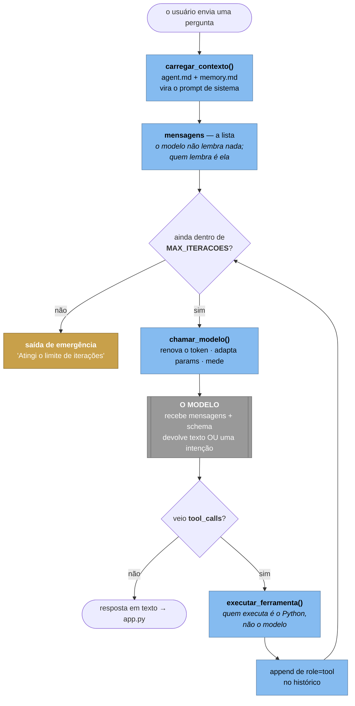

# Anatomia do harness — o que existe entre o modelo e o mundo

> **Por que este arquivo não é uma seção do `agent.md`.** O `agent.md` **é** o
> prompt de sistema: cada linha dele entra na conta de toda chamada ao modelo,
> em toda iteração do laço. Documentação ali custaria dinheiro para sempre —
> exatamente o que o [LAB-FINOPS.md](LAB-FINOPS.md) ensina a evitar. Material
> didático fica em arquivo `.md` de projeto; instrução para a Eva fica no
> `agent.md`. A separação é a própria lição.

---

## O que é "harness"

**Harness é tudo que fica entre o modelo e o mundo.**

O modelo de linguagem faz uma coisa só: recebe uma lista de mensagens e devolve
texto — ou a *intenção* de chamar uma função. Ele não executa nada, não lembra
de nada entre chamadas, não tenta de novo, não sabe parar e não sabe quanto
custou.

Tudo isso é responsabilidade do código em volta. Esse código é o harness (você
também vai ver *agent runtime*, *scaffolding* ou, em tradução livre, *arreio* —
a peça que transforma força bruta em direção).

A frase que costuma cair a ficha na turma:

> **Um agente é 5% modelo e 95% harness — e o harness não tem nenhuma linha de
> IA. É engenharia de software comum em volta de uma chamada HTTP.**

---

## Você já escreveu três harnesses (e um deles você terceirizou)

| Projeto | O harness é… | Quem escreveu | O que ele ensina |
| --- | --- | --- | --- |
| **00-agentebase** | `agent.py`, ~200 linhas | você | o esqueleto mínimo: laço, despacho, teto |
| **Eva / Eva-azure** | `eva.py` | você | o mesmo laço, com memória, streaming, identidade, telemetria e compatibilidade |
| **MeuAgenteLC** | `create_agent()` do LangChain | terceiros | o que um framework esconde — e o que cobra em troca |

A progressão dos projetos é uma progressão de harness: **escrever → engordar →
terceirizar**. Nessa ordem por um motivo: quem começa pelo `create_agent()`
não tem como saber o que ele está fazendo por baixo, e quando quebra não tem
por onde começar.

---

## O laço, que é o coração de tudo

`eva.py`, função `responder()` — linha 429. O trecho que importa:

```python
for _ in range(max_iteracoes or MAX_ITERACOES):          # 449 — o teto
    resposta = chamar_modelo(cliente, model=..., messages=mensagens,
                             tools=FERRAMENTAS, ...)      # 450 — o único ponto de saída
    recado = resposta.choices[0].message

    if not recado.tool_calls:                             # 460 — caso 1: acabou
        mensagens.append({"role": "assistant", "content": recado.content})
        return recado.content or ""

    mensagens.append(recado.model_dump(exclude_none=True))  # 465 — guarda o pedido

    for chamada in recado.tool_calls:                     # 467 — caso 2: executa
        argumentos = json.loads(chamada.function.arguments or "{}")
        mensagens.append({
            "role": "tool",
            "tool_call_id": chamada.id,
            "content": executar_ferramenta(nome, argumentos),   # 481
        })

return "Atingi o limite de iterações sem concluir..."     # 485 — saída de emergência
```

Quatro coisas para apontar em aula, nessa ordem:

1. **A linha 481 é o agente.** `executar_ferramenta` roda **no seu Python, na
   sua máquina, com as suas permissões**. O modelo só disse que queria. Se
   alguém entender uma coisa só desta página, que seja esta.
2. **`mensagens` é a memória.** Não existe estado dentro do modelo: a cada
   volta a conversa inteira é reenviada. É por isso que o histórico **é** o
   custo (veja o 3.1 do [LAB-FINOPS.md](LAB-FINOPS.md)).
3. **O `for` da linha 449 é o que separa um agente de um chatbot.** Um chatbot
   chama o modelo uma vez. Um agente chama até não precisar mais.
4. **A linha 485 não é detalhe.** Um laço sem teto não trava a aplicação — ele
   gasta. Silenciosamente, até a conta acabar.

---

## O diagrama do laço



Repare que **só uma caixa é cinza**. Todo o resto — o desenho inteiro — é
harness.

Este diagrama complementa o Nível 3 do [DIAGRAMAS.md](DIAGRAMAS.md): lá os
componentes aparecem lado a lado, aqui aparece a **ordem** em que eles agem.

---

## As dez responsabilidades, e onde cada uma mora

Cada linha desta tabela é algo que o modelo **não** faz:

| O modelo não… | Quem faz na Eva | Linha |
| --- | --- | --- |
| decide chamar de novo | o `for` de `responder()` | 449 |
| sabe parar | `MAX_ITERACOES` | 93 |
| executa nada | `executar_ferramenta()` | 330 |
| sabe o que existe | `FERRAMENTAS` — o schema que ele lê | 302 |
| lembra da conversa | a lista `mensagens`, mutada no lugar | 449–483 |
| monta o próprio prompt | `carregar_contexto()` | 228 |
| se autentica | `get_cliente()` + renovação por chamada | 152 · 412 |
| conhece os próprios parâmetros | `_param_recusado()` + `_criar_adaptando()` | 366 · 377 |
| se mede | `telemetria.medir_chamada()` | 418 |
| tem plano B | a mensagem de limite, o fallback do Key Vault | 485 · 147 |

### Duas peças que merecem atenção

**`chamar_modelo()` (linha 400) é o funil.** É o único ponto do código que fala
com a API. Três responsabilidades transversais moram ali — renovar o token,
adaptar parâmetros e medir — e por isso valem para `responder()` e
`responder_stream()` sem duplicação. A pergunta boa para a turma: *o que mais
deveria passar por esse funil?* (Retry, rate limit, cache, log de auditoria.)

**`_criar_adaptando()` (linha 377) é um harness que aprende.** Quando o serviço
recusa um parâmetro (`max_tokens` num modelo que só aceita
`max_completion_tokens`), ele lê o erro, descobre qual parâmetro foi, corrige e
tenta de novo — **e guarda o ajuste** em `_ajustes_aprendidos`. Da segunda
chamada em diante já sai certo. São 30 linhas que fazem o mesmo código
funcionar com modelos de gerações diferentes, sem `if modelo == "...":`
espalhado.

---

## O que este harness ainda não faz

A lista honesta — e não por acaso é o catálogo do que os frameworks vendem:

| Falta | O que acontece hoje | O que custaria acrescentar |
| --- | --- | --- |
| **Ferramentas em paralelo** | a linha 467 itera as `tool_calls` uma a uma; o modelo pode pedir três de uma vez | um `ThreadPoolExecutor` — mas cuidado com ferramenta que escreve |
| **Timeout por ferramenta** | um `consultar_api` pendurado trava o turno inteiro | um wrapper com `timeout` no despacho |
| **Retry com backoff** | o SDK tenta de novo por baixo; você não controla nem enxerga | 20 linhas no funil do `chamar_modelo()` |
| **Janela de contexto** | o histórico cresce até estourar o limite do modelo | sumarização, corte por idade, ou RAG |
| **Cancelamento** | o usuário fecha a aba e o laço continua gastando | um token de cancelamento verificado a cada volta |
| **Guardrails** | nada valida o que entra nem o que sai | um passo antes e um depois do laço |
| **Persistência da conversa** | vive na memória do processo; o contêiner morre e some | um armazenamento externo — muda o Nível 2 do C4 |
| **Roteamento de modelo** | um deployment para tudo | escolher modelo barato ou caro por complexidade do turno |

Nenhuma dessas ausências é defeito **neste** contexto — são as próximas aulas.
E cada uma vira uma pergunta melhor do que "qual framework usar?":

> *O LangChain resolve isso? Como? E o que ele cobra em troca de esconder?*

---

## Exercícios

1. **Ache o harness no framework.** Abra o `agent.py` do MeuAgenteLC e aponte,
   dentro do `create_agent()`, onde estão as dez responsabilidades da tabela
   acima. Quais o LangChain expõe? Quais ele esconde?
2. **Quebre o teto de propósito.** Rode a Eva com `EVA_MAX_ITERACOES=1` e faça
   uma pergunta que precise de ferramenta. Explique a resposta que veio.
3. **Instrumente o despacho.** Hoje `medir_chamada` envolve só a chamada ao
   modelo. Acrescente um span em `executar_ferramenta()` e responda com dado:
   qual ferramenta é a mais lenta, e quantas vezes cada uma é chamada?
   (É o exercício 6 do [LAB-OBSERVABILIDADE.md](LAB-OBSERVABILIDADE.md).)
4. **Escolha a próxima peça.** Das oito faltas da tabela, qual você
   acrescentaria primeiro nesta aplicação — e por quê? Defenda em um parágrafo.
   *(Uma resposta defensável: timeout por ferramenta, porque é a única que hoje
   pode travar um turno indefinidamente sem erro nenhum na tela.)*
5. **O difícil:** implemente o cancelamento. Repare que ele exige mudar a
   assinatura de `responder()` e o `app.py` junto — e que isso é a diferença
   entre uma preocupação local e uma preocupação transversal.

---

## Onde continuar

| Documento | O que ele responde |
| --- | --- |
| [DIAGRAMAS.md](DIAGRAMAS.md) | como as peças se organizam (C4, níveis 1 a 3) |
| [LAB-OBSERVABILIDADE.md](LAB-OBSERVABILIDADE.md) | como medir o que o harness faz |
| [LAB-FINOPS.md](LAB-FINOPS.md) | quanto cada volta do laço custa |
| `agent.md` | como mudar o comportamento **sem** tocar no harness |
