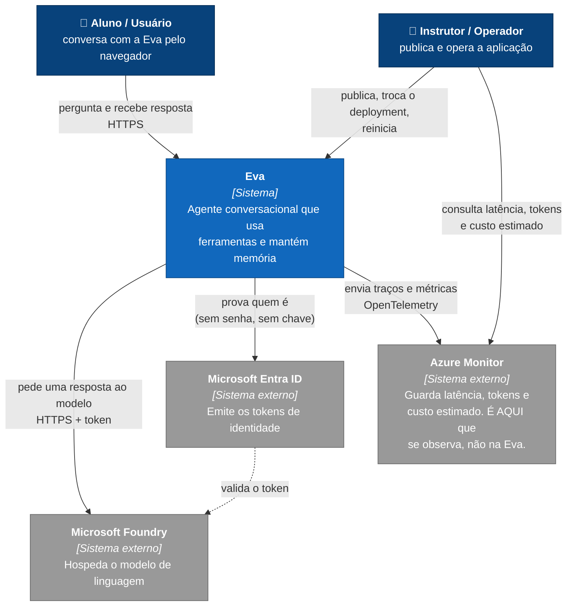
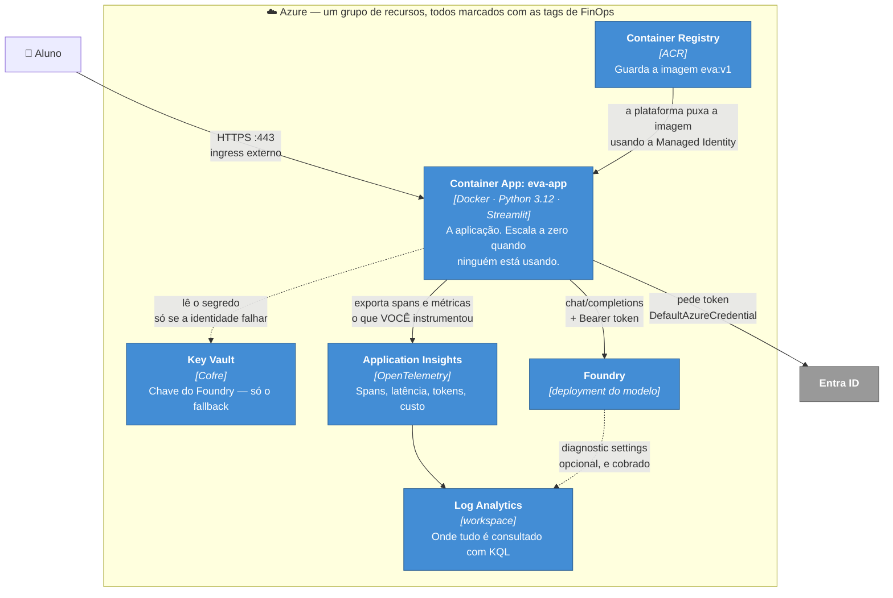
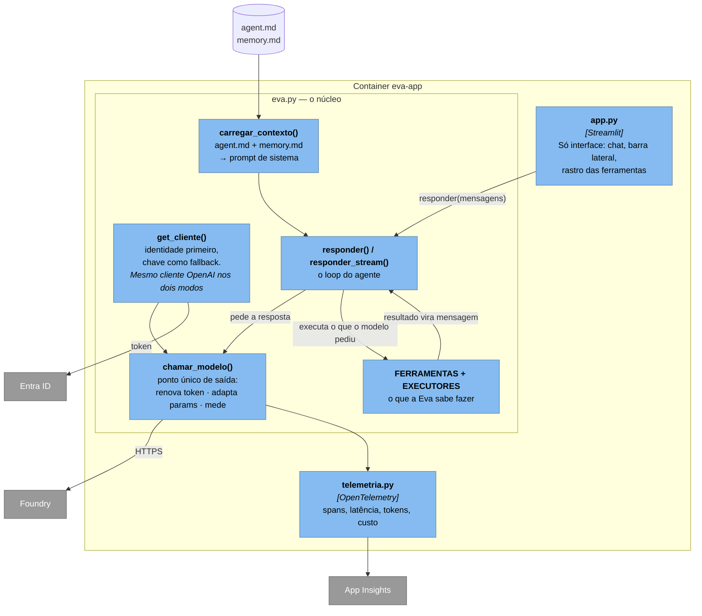
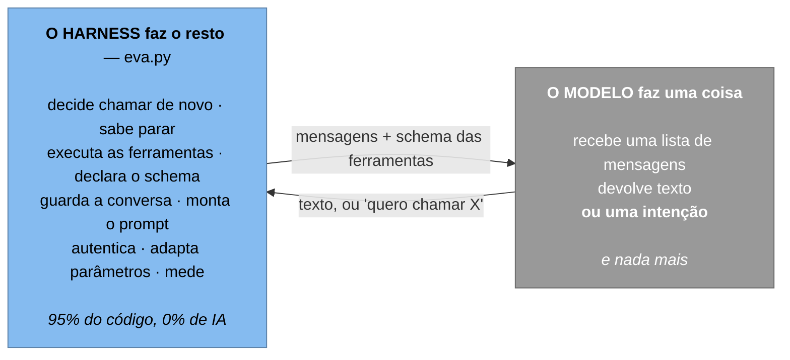
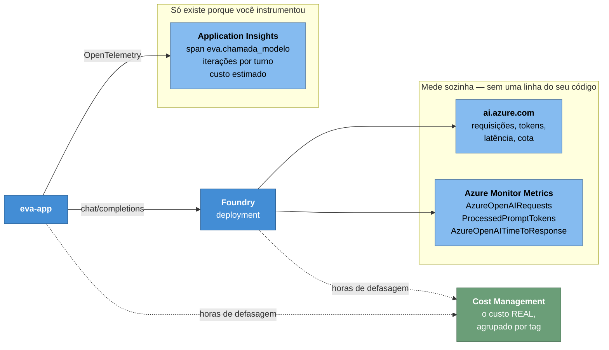
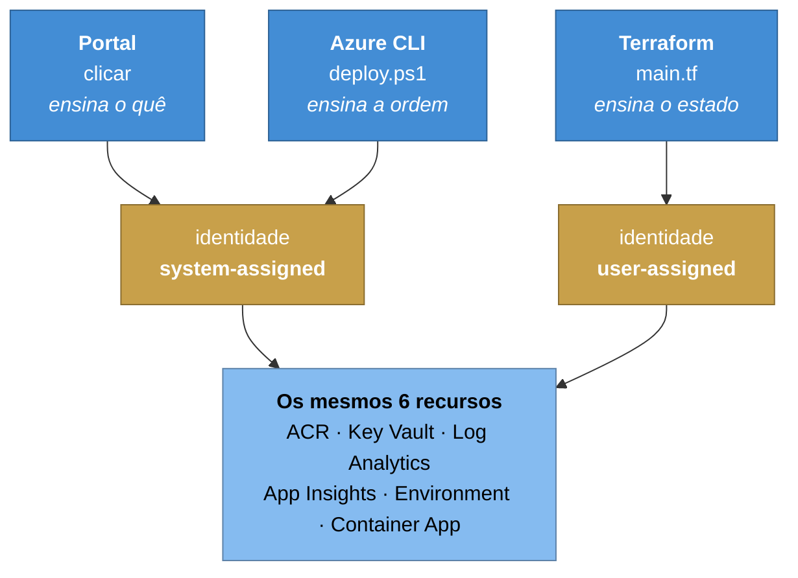
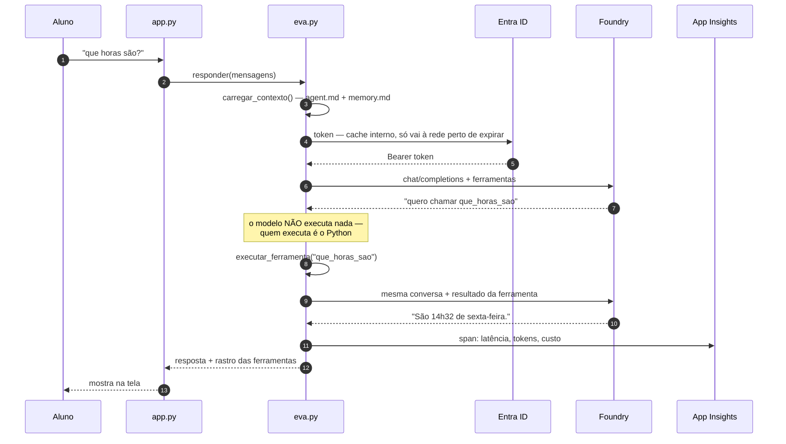

# Diagramas da solução — Eva no Azure

Modelo **C4**, de fora para dentro. Cada nível responde a uma pergunta
diferente, e cada um tem um público diferente:

| Nível | Pergunta | Para quem |
|---|---|---|
| **1. Contexto** | Quem usa o sistema e com o que ele fala? | qualquer pessoa |
| **2. Contêineres** | De que peças executáveis ele é feito? | quem opera e quem desenvolve |
| **3. Componentes** | O que existe dentro da aplicação? | quem vai mexer no código |
| **4. Código** | Como cada componente é escrito? | (o próprio código; não desenhamos) |

> A regra do C4 que mais economiza discussão: **um diagrama, um nível de
> abstração**. Misturar "usuário" com "função Python" no mesmo desenho é o que
> transforma diagrama em decoração.

---

## Nível 1 — Contexto

Quem interage com a Eva, e com quais sistemas externos ela fala. Nenhuma
tecnologia aparece aqui de propósito: este desenho continua válido se
trocarmos Streamlit por React ou Azure por AWS.

**Duas relações que valem parar:**

**A seta pontilhada.** A Eva não guarda credencial: ela pede um token ao Entra
e o Foundry valida esse token. É a relação que os alunos costumam não enxergar
— **quem autoriza não é quem atende**.

**O instrutor tem duas setas, e elas vão para lugares diferentes.** Ele
*publica e opera* a Eva, mas **não observa através dela**: a aplicação não tem
painel de custo nem de latência. A barra lateral mostra apenas se a telemetria
está ligada e se os preços foram configurados — nada de histórico, nada de
gráfico.

Quem observa, observa na **plataforma**: Azure Monitor / Application Insights
para o que a aplicação instrumentou, e as métricas do próprio Foundry para o
que o serviço mede sozinho (essas ficaram fora do desenho para não poluir — o
diagrama de observabilidade, mais abaixo, abre as três janelas).

Essa separação não é detalhe de desenho, é decisão de arquitetura: **construir
painel dentro da aplicação é reimplementar, pior, o que a plataforma já faz.**
E é a resposta para a pergunta que sempre aparece: *"por que a Eva não mostra
quanto já gastei?"*

---

## Nível 2 — Contêineres

Cada caixa aqui é algo que **executa ou armazena** separadamente — não é
"classe", nem "container Docker" necessariamente.

**As três coisas que valem parar e explicar:**

1. **A seta do Key Vault é pontilhada** porque é caminho de exceção. No fluxo
   normal ela não acontece — e quando acontece, a interface avisa. Fallback
   silencioso é pior que fallback nenhum: a aplicação continua de pé com a
   identidade quebrada e ninguém fica sabendo.
2. **O ACR aponta para o app, não o contrário.** Quem puxa a imagem é a
   plataforma do Container Apps, antes do seu código existir. Por isso a
   identidade precisa da role `AcrPull` *antes* do primeiro deploy da imagem
   privada — e por isso o app nasce com uma imagem pública descartável.
3. **`min-replicas 0`**: sem tráfego, zero contêiner e zero custo de compute.
   O preço é a primeira requisição depois da ociosidade ser lenta (cold start).
4. **A marcação está no título do grupo, não numa caixa.** Tag não é
   componente — é atributo de todos eles. As sete tags (`projeto`, `ambiente`,
   `centro-custo`, `responsavel`, `criado-por`, `criado-em`, `descartavel`) vão
   em cada recurso, porque **tag não é herdada do grupo**. É o que permite
   responder "quanto custou a aula?" no Cost Management.
5. **A seta do Foundry para o Log Analytics é pontilhada** porque é opcional e
   cobrada. O Foundry já emite métricas de plataforma de graça; o que essa seta
   liga é o **log da requisição** — caro em volume, e carregando o que o
   usuário digitou.

---

## Nível 3 — Componentes da aplicação

Agora dentro do `eva-app`. Cada caixa é um módulo ou uma função com
responsabilidade própria.

**Por que `chamar_modelo()` é o componente mais importante do desenho:** é o
**ponto único de saída**. Três responsabilidades transversais moram ali —
renovar o token do Entra, adaptar parâmetros que o modelo recusa
(`max_tokens` → `max_completion_tokens`) e medir a chamada. Como
`responder()` e `responder_stream()` passam pelo mesmo lugar, cada uma dessas
três coisas foi escrita **uma vez** e vale para os dois caminhos.

Se essa lógica estivesse duplicada nas duas funções, toda correção precisaria
ser feita em dois lugares — e mais cedo ou mais tarde só um deles seria
corrigido. Vale como pergunta para a turma: *o que mais deveria passar por
esse funil?* (Retry, rate limit, cache, log de auditoria.)

**E por que `get_cliente()` devolve o mesmo tipo de cliente nos dois modos.**
Chave e identidade mudam só a credencial — a classe é a mesma (`OpenAI`) e a
rota é a mesma (`/openai/v1/`). Trocar para `AzureOpenAI` no modo identidade
parece natural e **quebra**: aquele cliente foi feito para a rota clássica e
reescreve o caminho da URL, inserindo `/deployments/<modelo>/`. O resultado é
`404 Resource not found`, um erro que aponta para o lugar errado.

A simetria é deliberada: se mudar a autenticação mudasse também a rota, você
nunca saberia qual das duas quebrou.

### O mesmo nível, por outra lente: o harness

O desenho acima mostra as peças **lado a lado**. Vale um segundo olhar sobre o
mesmo nível, agora perguntando *quem é responsável pelo quê* — porque a divisão
não é a que a maioria das pessoas imagina:

**Harness** é o nome desse código em volta — o que fica entre o modelo e o
mundo. Todo o Nível 3 acima é harness, exceto a seta que sai para o Foundry.

Isso reposiciona uma pergunta comum na sala: *"qual framework de agente
usar?"*. O `create_agent()` do LangChain, usado no projeto MeuAgenteLC, é
exatamente esta caixa azul — escrita por outra pessoa. Escrever ela primeiro,
como fizemos aqui e no `agentebase`, é o que permite avaliar depois **o que o
framework esconde e o que cobra em troca**.

O [ANATOMIA-DO-HARNESS.md](ANATOMIA-DO-HARNESS.md) abre a caixa azul: o
diagrama do laço passo a passo, as dez responsabilidades com número de linha, e
a lista honesta do que este harness ainda **não** faz.

---

## Observabilidade — as três janelas

Nenhum dos diagramas acima mostra **quem consegue ver o quê**. E essa é a
pergunta que aparece quando algo dá errado em produção.

**A divisão que importa:** o lado esquerdo mede **o serviço** e existe de
graça, sem você fazer nada. O lado direito mede **a sua aplicação** e só existe
porque o `telemetria.py` está lá.

Três perguntas, três janelas diferentes — e é por isso que nenhuma sozinha
basta:

| Pergunta | Onde |
| --- | --- |
| "Tomei 429?" | só nas métricas de plataforma — o SDK tenta de novo e sua app nem sabe |
| "Quantas iterações por turno?" | só no Application Insights — a plataforma não sabe que existe um agente |
| "Quanto vou pagar?" | só no Cost Management — e com horas de atraso |

Os dois números de token **não vão bater**: o Foundry conta o que processou
(incluindo retry), a Eva conta o que o SDK devolveu. Para cobrança vale o do
provedor; o seu é estimativa para decidir em tempo real.

O [LAB-OBSERVABILIDADE.md](LAB-OBSERVABILIDADE.md) percorre as três com KQL.

---

## Provisionamento — três caminhos, os mesmos recursos

**Por que o Terraform usa identidade diferente** — e não é preferência:

O `azurerm` não aceita identidade *system-assigned* no bloco `registry` do
Container App. E há uma dependência circular: com system-assigned, o
`principal_id` só existe **depois** que o app é criado, mas o app precisa da
role `AcrPull` para conseguir puxar a imagem e nascer.

No portal e na CLI isso se resolve em duas fases manuais — criar o app com uma
imagem pública, dar a identidade, trocar a imagem. **Em IaC declarativa esse
"depois" não existe.** A identidade autônoma quebra o ciclo: nasce primeiro,
recebe as roles, e o app já nasce podendo.

É o exemplo mais concreto do curso de uma coisa que ninguém escolhe por
preferência — a ferramenta impõe.

---

## Sequência — uma pergunta, do clique à resposta

Não faz parte do C4, mas é o complemento que responde "e o que acontece
**quando**":

O passo 6→7 é o coração do agente e o que mais confunde: **o modelo devolve
uma intenção, não uma execução.** Ele diz "quero chamar `que_horas_sao`" e
para. Quem roda a função é o seu Python, na sua máquina, com as suas
permissões. É isso que torna o `MAX_ITERACOES` necessário — o ciclo 6→9 pode
se repetir.

---

## O que os diagramas deixam de fora, de propósito

Um diagrama honesto tem uma lista assim:

- **Rede** — não há VNet, private endpoint nem firewall. O Foundry está
  acessível pela internet pública, protegido só por identidade. Em produção
  de verdade isso mudaria, e mudaria o nível 2.
- **Estado** — não há banco. O histórico da conversa vive na memória do
  processo, e a `memory.md` está *dentro da imagem*: com `min-replicas 0`, o
  que a Eva "aprender" some quando o contêiner morre. É a limitação mais
  importante desta arquitetura, e a que justifica o próximo passo.
- **Escala** — uma réplica não conversa com a outra. Com duas réplicas, dois
  usuários podem ver memórias diferentes.
- **CI/CD** — o deploy é um script rodado à mão. Não há pipeline, não há
  ambiente de homologação, não há rollback automático.
- **Amostragem de telemetria** — toda chamada vira span. Em volume real isso
  custa; a saída é *sampling*, que troca precisão por conta menor.

O que **deixou** de faltar desde a primeira versão destes diagramas: a
marcação de FinOps (agora em todos os recursos, nos três caminhos de
provisionamento) e a análise da telemetria (o
[LAB-OBSERVABILIDADE.md](LAB-OBSERVABILIDADE.md)).

Bom exercício de arquitetura: **qual caixa você acrescentaria primeiro?**
(Uma resposta defensável: um armazenamento externo para o estado — e reparar
que isso muda o nível 2, não o nível 1. O contexto continua o mesmo.)
