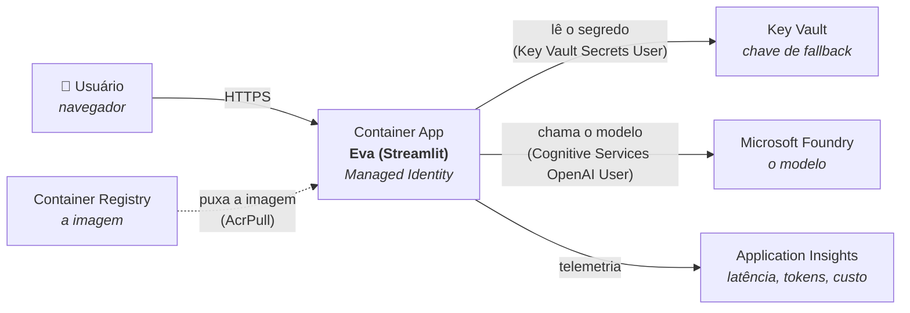

# Guia — publicar a Eva pela linha de comando

Do código local até uma URL pública, com Managed Identity, Key Vault e
Application Insights. Cada comando vem com o motivo dele.

> **Faça este guia depois do guia do portal**, não antes. No portal você vê o
> que cada recurso é; aqui você vê como automatizar. Quem começa pela CLI
> decora comandos sem entender o que está criando.

---

## O que vamos construir



As três setas com role entre parênteses são o coração desta arquitetura:
**nenhuma delas usa senha**. O Container App tem uma identidade, e cada recurso
decide o que aquela identidade pode fazer.

---

## Passo 0 — Preparar a CLI

```powershell
az login
az account show --output table          # confira se é a assinatura certa
az account set --subscription "<nome ou id>"   # se precisar trocar
```

Extensões e provedores (uma vez por assinatura):

```powershell
az extension add --name containerapp --upgrade
az extension add --name application-insights --upgrade
az provider register --namespace Microsoft.App --wait
az provider register --namespace Microsoft.OperationalInsights --wait
```

> Se pular o `az provider register`, a criação do ambiente falha com uma
> mensagem sobre "subscription not registered" — que não diz o que fazer.

Defina as variáveis (ajuste os três primeiros valores para os seus):

```powershell
$FOUNDRY_RG   = "rg-fiap-agente-02"
$FOUNDRY_NOME = "curso-agentes"
$DEPLOYMENT   = "gpt-5.4-mini"

$RG      = "curso-agentes-resource"
$LOCAL   = "eastus2"
$SUFIXO  = -join ((48..57)+(97..122) | Get-Random -Count 6 | ForEach-Object {[char]$_})
$ACR     = "evaacr$SUFIXO"
$KV      = "eva-kv-$SUFIXO"
$APPI    = "eva-appi"
$LOGS    = "eva-logs"
$AMBIENTE = "eva-env"
$APP     = "eva-app"
```

> **Por que o sufixo aleatório:** nome de ACR e de Key Vault precisa ser único
> no **mundo inteiro**, não só na sua assinatura. `eva-kv` já foi usado por
> alguém. Numa turma de 30 alunos, isso importa.

---

## Passo 0.5 — Marcação (tags) para FinOps

No Azure a fatura vem **por recurso**. Sem marcação, a pergunta "quanto custou
a aula de agentes?" não tem resposta: você abre o Cost Management e vê seis
linhas com nomes crus, sem saber qual pertence a quê.

Defina o conjunto uma vez e use em todos os comandos:

```powershell
$RESP = (az ad signed-in-user show --query userPrincipalName -o tsv).ToLower()
$TAGS = @(
  "projeto=eva-agente",
  "ambiente=aula",
  "centro-custo=fiap-mba-ia",
  "responsavel=$RESP",
  "criado-por=cli",
  "criado-em=$(Get-Date -Format 'yyyy-MM-dd')",
  "descartavel=sim"
)
```

Depois é só acrescentar `--tags $TAGS` em **cada** `az ... create` dos passos
seguintes — grupo, ACR, workspace, Application Insights, Key Vault, ambiente
do Container Apps e o app.

### As três coisas que quase todo mundo erra

**1. Tag não é herdada.** Marcar o grupo de recursos **não** marca o que está
dentro dele. É contraintuitivo, e é a causa número um de cobertura furada.
Existe Azure Policy para forçar a herança (`Inherit a tag from the resource
group`), mas por padrão cada recurso precisa da sua.

**2. O Azure cria recursos que você não pediu.** O Container Apps provisiona o
próprio ambiente gerenciado, o Log Analytics cria estruturas internas. Eles
aparecem na fatura e não na sua lista mental. Por isso vale um passo de
reconciliação no fim:

```powershell
foreach ($id in (az resource list -g $RG --query "[].id" -o tsv)) {
    az tag update --resource-id $id --operation merge --tags $TAGS
}
```

O `--operation merge` acrescenta sem apagar o que já existia.

**3. Cobertura se verifica, não se presume.** Uma linha responde se sobrou
alguma coisa sem dono:

```powershell
az resource list -g $RG --query "[?tags.projeto==null].name" -o tsv
```

**Recurso sem tag é custo sem dono** — e custo sem dono ninguém corta.

### Por que estas sete tags

Cada uma responde a uma pergunta que alguém faz depois:

| Tag | A pergunta que ela responde |
| --- | --- |
| `projeto` | a que iniciativa esse gasto pertence? |
| `ambiente` | isso é produção ou experimento? |
| `centro-custo` | quem paga? |
| `responsavel` | a quem eu pergunto antes de apagar? |
| `criado-por` | veio de automação ou alguém fez na mão? |
| `criado-em` | há quanto tempo isso existe? |
| `descartavel` | posso apagar sem consultar ninguém? |

As duas últimas são as que mais economizam dinheiro em ambiente de
aprendizado, e quase nunca aparecem nos exemplos: são elas que permitem varrer
o que ficou esquecido depois do semestre.

Limites do Azure: 50 tags por recurso, chave até 512 e valor até 256
caracteres. Evite espaço e acento no **valor** — o Cost Analysis agrupa por
texto exato, e o CSV exportado fica mais fácil de tratar.

### Ver o custo por marcação

**No portal — este é o caminho principal, e não exige instalar nada:**
**Cost Management → Cost analysis → Group by → Tag → `projeto`**.

> ⚠️ **`az costmanagement query` não existe mais.** O comando foi **removido**
> da extensão `costmanagement` na versão 0.2.1, então instalar a extensão não
> resolve. O erro que aparece — `'costmanagement' is misspelled or not
> recognized by the system` — sugere erro de digitação e manda para o lugar
> errado. Material antigo (inclusive versões anteriores deste guia) ainda
> mostra esse comando.

Se você quiser automatizar, o caminho que continua funcionando é chamar a API
de Cost Management direto, com `az rest`. O corpo da consulta fica em
`infra/consulta-custo.json`:

```json
{
  "type": "ActualCost",
  "timeframe": "MonthToDate",
  "dataset": {
    "granularity": "None",
    "aggregation": { "totalCost": { "name": "Cost", "function": "Sum" } },
    "grouping": [ { "type": "TagKey", "name": "projeto" } ]
  }
}
```

```powershell
cd infra
$sub = az account show --query id -o tsv
az rest --method post `
  --url "https://management.azure.com/subscriptions/$sub/providers/Microsoft.CostManagement/query?api-version=2026-06-01" `
  --body "@consulta-custo.json"
```

Três detalhes que decidem se funciona:

1. **As aspas em `"@consulta-custo.json"` são obrigatórias.** Sem elas o
   PowerShell lê o `@` como operador de array (*splatting*) e o arquivo nunca
   chega ao `az`.
2. **O corpo vai em arquivo, não inline.** JSON inline na linha de comando
   esbarra no mesmo problema de aspas que quebrou o passo 13 do `deploy.ps1`.
3. **`"name": "Cost"`** vale para contratos MCA (o caso do Azure for Students).
   Em contrato **EA** o campo se chama `PreTaxCost` — se a resposta vier vazia
   ou com erro de agregação, é isso.

> **A tag só vale a partir do momento em que existe.** Custo que já foi gerado
> antes da marcação não é reclassificado retroativamente. É por isso que tag
> se aplica na criação, e não "depois, quando der" — e é o argumento que faz
> a turma levar isso a sério.

---

## Passo 1 — Grupo de recursos

```powershell
az group create --name $RG --location $LOCAL --tags $TAGS
```

Tudo vai para dentro dele. No fim da aula, um `az group delete` apaga tudo de
uma vez — é o melhor mecanismo de controle de custo que existe.

---

## Passo 2 — Container Registry

```powershell
az acr create --resource-group $RG --name $ACR --sku Basic --tags $TAGS
```

É onde a imagem da aplicação vai morar. `Basic` basta e é o mais barato.

---

## Passo 3 — Build da imagem, na nuvem

```powershell
cd C:\FIAP-Projects\AI\Agentes\Eva-azure
az acr build --registry $ACR --image eva:v1 .
```

**Esse comando não usa o Docker da sua máquina.** Ele empacota a pasta, envia
para o Azure, e o build acontece lá. Numa sala de aula isso remove o maior
obstáculo: não precisa de Docker Desktop instalado e funcionando em 30 máquinas.

O `.` no fim é o contexto do build — a pasta que será enviada. O
`.dockerignore` decide o que fica de fora, e a primeira linha dele é `.env`.

Confira o que subiu:

```powershell
az acr repository show-tags --name $ACR --repository eva --output table
```

---

## Passo 4 — Application Insights

Precisa de um workspace do Log Analytics por baixo:

```powershell
az monitor log-analytics workspace create --resource-group $RG --workspace-name $LOGS --tags $TAGS

$WS_ID = az monitor log-analytics workspace show `
  --resource-group $RG --workspace-name $LOGS --query id -o tsv

az monitor app-insights component create `
  --app $APPI --location $LOCAL --resource-group $RG --workspace $WS_ID `
  --tags $TAGS

$APPI_CONN = az monitor app-insights component show `
  --app $APPI --resource-group $RG --query connectionString -o tsv
```

A `connectionString` é o único valor que a aplicação precisa — ela vai virar a
variável `APPLICATIONINSIGHTS_CONNECTION_STRING` no passo 11.

---

## Passo 5 — Key Vault e a chave de fallback

```powershell
az keyvault create --name $KV --resource-group $RG --location $LOCAL `
  --enable-rbac-authorization true --tags $TAGS
```

> **`--enable-rbac-authorization true`** faz o Key Vault usar as roles do Azure
> em vez das antigas "access policies". É o modelo atual, e é o que permite dar
> permissão para a Managed Identity com um `az role assignment`.

Você precisa de permissão para **gravar** o segredo — ser Owner da assinatura
não basta, porque o plano de dados do Key Vault é separado:

```powershell
$MEU_ID = az ad signed-in-user show --query id -o tsv
$KV_ID  = az keyvault show --name $KV --resource-group $RG --query id -o tsv

az role assignment create --role "Key Vault Secrets Officer" `
  --assignee-object-id $MEU_ID --assignee-principal-type User --scope $KV_ID

Start-Sleep -Seconds 30   # role leva alguns segundos para valer
```

Agora pegue a chave do Foundry e guarde nele:

```powershell
$CHAVE = az cognitiveservices account keys list `
  --name $FOUNDRY_NOME --resource-group $FOUNDRY_RG --query key1 -o tsv

az keyvault secret set --vault-name $KV --name "foundry-api-key" --value $CHAVE

$SEGREDO_URI = az keyvault secret show --vault-name $KV --name "foundry-api-key" --query id -o tsv
$SEGREDO_URI = $SEGREDO_URI -replace '/[^/]+$', ''    # tira a versão
```

> **Por que tirar a versão do URI:** com versão, o Container App fica preso
> àquela versão do segredo — se você rotacionar a chave, ele continua lendo a
> antiga. Sem versão, ele sempre pega a mais recente.
>
> **E por que guardar uma chave, se a identidade não precisa dela?** É o
> fallback. Se a Managed Identity falhar, a aplicação continua de pé — e avisa
> na tela que está no fallback, para alguém investigar. Um fallback silencioso
> seria pior que nenhum.

---

## Passo 6 — Ambiente do Container Apps

```powershell
$WS_CUSTOMER = az monitor log-analytics workspace show `
  --resource-group $RG --workspace-name $LOGS --query customerId -o tsv
$WS_KEY = az monitor log-analytics workspace get-shared-keys `
  --resource-group $RG --workspace-name $LOGS --query primarySharedKey -o tsv

az containerapp env create --name $AMBIENTE --resource-group $RG --location $LOCAL `
  --logs-workspace-id $WS_CUSTOMER --logs-workspace-key $WS_KEY `
  --tags $TAGS
```

O ambiente é a fronteira de rede e de logs. Vários apps podem dividir o mesmo
ambiente e conversar entre si por nome.

Demora alguns minutos. É o passo mais lento.

---

## Passo 7 — Criar o app (com imagem pública, de propósito)

```powershell
az containerapp create --name $APP --resource-group $RG `
  --environment $AMBIENTE `
  --image "mcr.microsoft.com/k8se/quickstart:latest" `
  --target-port 80 --ingress external `
  --min-replicas 0 --max-replicas 2 `
  --tags $TAGS
```

**Por que uma imagem que não é a nossa?** Ordem de dependência: o app precisa
existir para receber uma identidade, e precisa da identidade para conseguir
puxar a imagem privada do ACR. Se você tentar criar já com a imagem privada,
falha com erro de autenticação no registry. Nasce com uma imagem descartável e
troca no passo 11.

`--min-replicas 0` faz o app **escalar até zero** quando ninguém usa: sem
tráfego, sem custo de computação. O preço é a primeira requisição depois de um
tempo parado demorar alguns segundos (cold start). Para uma aula, é a troca
certa.

---

## Passo 8 — Managed Identity

```powershell
$PRINCIPAL = az containerapp identity assign --name $APP --resource-group $RG `
  --system-assigned --query principalId -o tsv
```

Pronto: o app agora tem identidade própria no Entra ID. **System-assigned**
significa que ela nasce e morre com o app — apagou o app, a identidade some, e
não fica lixo de permissão para trás.

---

## Passo 9 — As três permissões

Aqui está o coração do guia. Cada uma substitui uma senha que você não vai
precisar guardar.

```powershell
$ACR_ID = az acr show --name $ACR --resource-group $RG --query id -o tsv
$FOUNDRY_ID = az cognitiveservices account show `
  --name $FOUNDRY_NOME --resource-group $FOUNDRY_RG --query id -o tsv

# 1. puxar a imagem do registry (substitui usuário/senha do ACR)
az role assignment create --role "AcrPull" `
  --assignee-object-id $PRINCIPAL --assignee-principal-type ServicePrincipal --scope $ACR_ID

# 2. ler o segredo no Key Vault
az role assignment create --role "Key Vault Secrets User" `
  --assignee-object-id $PRINCIPAL --assignee-principal-type ServicePrincipal --scope $KV_ID

# 3. chamar o modelo (substitui a API key do Foundry)
az role assignment create --role "Cognitive Services OpenAI User" `
  --assignee-object-id $PRINCIPAL --assignee-principal-type ServicePrincipal --scope $FOUNDRY_ID

Start-Sleep -Seconds 45
```

> **O `Start-Sleep` não é frescura.** Atribuição de role no Entra ID leva de
> segundos a alguns minutos para propagar. Se você seguir na hora, o app sobe,
> tenta autenticar, toma 403 e você vai debugar um problema que já se resolveu
> sozinho enquanto você lia o log.
>
> **`--assignee-principal-type ServicePrincipal`** evita outra corrida: sem
> isso, a CLI tenta resolver o object-id no Entra e às vezes falha porque a
> identidade acabou de nascer.

Confira:

```powershell
az role assignment list --assignee $PRINCIPAL --all --output table
```

---

## Passo 10 — Registry pela identidade

```powershell
az containerapp registry set --name $APP --resource-group $RG `
  --server "$ACR.azurecr.io" --identity system
```

Repare no que **não** existe aqui: nenhum `--username`, nenhum `--password`.

---

## Passo 11 — Segredo, variáveis e a imagem de verdade

```powershell
az containerapp secret set --name $APP --resource-group $RG `
  --secrets "foundry-key=keyvaultref:$SEGREDO_URI,identityref:system"
```

A sintaxe `keyvaultref:<uri>,identityref:system` diz: *este segredo não está
guardado aqui — busque no Key Vault, usando a minha identidade*. O valor nunca
fica armazenado no Container App.

```powershell
$FOUNDRY_ENDPOINT = az cognitiveservices account show `
  --name $FOUNDRY_NOME --resource-group $FOUNDRY_RG --query properties.endpoint -o tsv

az containerapp update --name $APP --resource-group $RG `
  --image "$ACR.azurecr.io/eva:v1" `
  --set-env-vars `
    "AZURE_FOUNDRY_ENDPOINT=$FOUNDRY_ENDPOINT" `
    "AZURE_FOUNDRY_DEPLOYMENT=$DEPLOYMENT" `
    "AZURE_FOUNDRY_AUTH=entra" `
    "AZURE_FOUNDRY_API_KEY=secretref:foundry-key" `
    "APPLICATIONINSIGHTS_CONNECTION_STRING=$APPI_CONN"
```

`secretref:foundry-key` monta a corrente completa:

```text
variável de ambiente  →  secret do Container App  →  Key Vault
     (o app lê)            (referência, não valor)     (o valor)
```

---

## Passo 12 — Ajustar a porta

O app nasceu apontando para a porta 80 (da imagem descartável). O Streamlit
escuta na 8501:

```powershell
az containerapp ingress update --name $APP --resource-group $RG --target-port 8501

az containerapp show --name $APP --resource-group $RG `
  --query properties.configuration.ingress.fqdn -o tsv
```

Abra a URL que apareceu. Na barra lateral deve aparecer
**🔐 identidade (Managed Identity / az login)**. Se aparecer *FALLBACK*, a
identidade não está funcionando — vá para a seção de problemas.

---

## Ver a telemetria

Converse com a Eva algumas vezes e depois, no portal, abra o Application
Insights → **Logs**:

```kusto
// Latência das chamadas ao modelo
dependencies
| where name == "eva.chamada_modelo"
| summarize p50=percentile(duration,50), p95=percentile(duration,95), n=count()
    by tostring(customDimensions["eva.deployment"])
```

```kusto
// Tokens e custo estimado por deployment
customMetrics
| where name in ("eva.tokens", "eva.custo.estimado")
| summarize total=sum(value) by name, tostring(customDimensions["deployment"])
```

> O custo sai zerado até você preencher `EVA_PRECO_ENTRADA_POR_1M` e
> `EVA_PRECO_SAIDA_POR_1M` com os preços do seu modelo. Deixei em zero de
> propósito: preço inventado em painel de custo é pior que painel nenhum.

Logs da aplicação em tempo real:

```powershell
az containerapp logs show -n $APP -g $RG --follow
```

---

## Publicar uma alteração

```powershell
az acr build --registry $ACR --image eva:v2 .
az containerapp update --name $APP --resource-group $RG --image "$ACR.azurecr.io/eva:v2"
```

Use uma tag nova a cada versão. Com `:latest`, o Container Apps pode não
perceber que a imagem mudou — e você fica olhando para a versão velha achando
que o deploy falhou.

---

## Problemas comuns

| Sintoma | Causa |
| --- | --- |
| App não sobe, log diz erro de autenticação no registry | Passo 10 antes do 9, ou role AcrPull ainda propagando |
| Barra lateral mostra **FALLBACK** | Falta a role *Cognitive Services OpenAI User* na identidade, ou ainda propagando |
| App sobe mas a página não abre | `--target-port` errado; tem que ser 8501 (passo 12) |
| `Unable to get secret` | Falta *Key Vault Secrets User* na identidade, ou o vault não está em modo RBAC |
| `subscription not registered` | Faltou o `az provider register` do passo 0 |
| Nome de ACR/Key Vault recusado | Precisa ser único no mundo — use outro sufixo |
| Telemetria não aparece | Leva alguns minutos; e confira a variável `APPLICATIONINSIGHTS_CONNECTION_STRING` |
| Primeira resposta demora muito | Cold start do `--min-replicas 0`. Suba para 1 se incomodar |
| `'}' de fechamento ausente` ao rodar o `.ps1` | Arquivo salvo em UTF-8 **sem BOM**: o PowerShell 5.1 lê como ANSI e um travessão dentro de string vira aspa. Salve com BOM |
| `NativeCommandError` logo no passo 0 | `$ErrorActionPreference = "Stop"` transformando um aviso do `az` em erro fatal. Use `Continue` + `$LASTEXITCODE` |
| `MaxNumberOfRegionalEnvironments...Exceeded` | A assinatura só permite 1 ambiente do Container Apps por região. Reaproveite o existente ou use outra região |
| `ResourceGroupNotFound` no grupo do Foundry | Trocou o recurso pelo grupo, ou usou o grupo da aplicação. Veja "Os quatro nomes que se parecem" |
| Saída com `Permissões`, `pública` | Mesmo problema do BOM — o console está lendo o `.ps1` como ANSI |
| Custo não aparece agrupado por projeto | Faltou `--tags` em algum `create`. Rode o `az resource list -g $RG --query "[?tags.projeto==null].name"` |
| Tag aplicada mas o custo antigo não mudou de grupo | Marcação não é retroativa: só vale a partir do momento em que existe |

Diagnóstico dentro do container:

```powershell
az containerapp exec -n $APP -g $RG --command "/bin/sh"
# lá dentro:  env | grep AZURE   e   python verificar.py
```

---

## Apagar tudo

```powershell
az group delete --name $RG --yes --no-wait
```

O recurso do Foundry está em outro grupo e não é afetado.

> Faça isso ao fim da aula. Container App com `--min-replicas 0` custa quase
> nada parado, mas ACR, Log Analytics e Key Vault têm custo fixo pequeno que
> some ao longo do mês — e numa turma são 30 grupos de recursos.

---

## Turma inteira rodando ao mesmo tempo

Pergunta que sempre aparece antes do primeiro lab coletivo: **os nomes vão
colidir?** A resposta depende do escopo de cada nome — e são três escopos
diferentes.

| Recurso | Onde o nome precisa ser único | Colide entre alunos? |
| --- | --- | --- |
| **Container Registry** | no **mundo** (`*.azurecr.io`) | não — já leva sufixo aleatório |
| **Key Vault** | no **mundo** (`*.vault.azure.net`) | não — já leva sufixo aleatório |
| **Grupo de recursos** | na **assinatura** | **sim, se a assinatura for compartilhada** |
| Container App, Environment, App Insights, Log Analytics | no **grupo de recursos** | só se o grupo colidir |
| URL da aplicação | o ambiente gera um domínio único | não |

### O que o sufixo NÃO resolve

**A cota de ambiente do Container Apps.** A assinatura permite **um** ambiente
por região. Numa assinatura compartilhada, o primeiro aluno cria e os demais
batem em `MaxNumberOfRegionalEnvironmentsInSubExceeded` — cada um no seu grupo,
e ainda assim bloqueados.

Três saídas, em ordem de preferência:

1. **Uma assinatura por aluno.** É o cenário do Azure for Students e o que o
   lab assume.
2. **Regiões diferentes** — `-Local westus3`, `-Local brazilsouth`. Resolve a
   cota, mas muda latência e preço entre alunos.
3. **Um ambiente compartilhado.** O script reaproveita um ambiente existente,
   inclusive de outro grupo. Funciona, mas acopla a turma: o ambiente é a
   fronteira de rede e de logs, e quem apagar derruba todo mundo.

**As cotas do Foundry.** Se todos apontarem para o mesmo deployment, dividem o
mesmo TPM. Quinze alunos perguntando junto = 429 para todos. É um ótimo momento
para mostrar o 429 ao vivo — desde que seja de propósito.

---

## O script pronto

Tudo isso está em [`infra/deploy.ps1`](infra/deploy.ps1). Um parâmetro basta:

```powershell
cd infra
.\deploy.ps1 -FoundryResourceName "https://SEU-RECURSO.services.ai.azure.com"
```

Pode colar o endpoint direto do `.env` do projeto anterior — o script extrai o
nome do recurso, **descobre o grupo de recursos** pelo nome e, se o recurso
tiver um único deployment, **usa aquele**. Os outros parâmetros existem, mas só
para quando você quiser fugir do padrão:

```powershell
.\deploy.ps1 -FoundryResourceName "curso-agentes-resource" `
             -Deployment "eva-aula" `
             -ResourceGroup "rg-outro-nome" `
             -Local "brazilsouth"
```

> **PowerShell não aceita `&&`** e a continuação de linha é crase (`` ` ``), não
> contrabarra. Se copiar um comando em bash da documentação da Microsoft, isso
> quebra.

### Os quatro nomes que se parecem

Esta é a confusão número um deste laboratório, e vale desenhar no quadro:

| Nome | O que é | Onde entra |
| --- | --- | --- |
| `curso-agentes-resource` | o **recurso** do Foundry — onde o modelo mora | `-FoundryResourceName` |
| `curso-agentes` | o **projeto** do Foundry — organização do portal | **não entra** |
| `eva-aula` | o **deployment** do modelo | `-Deployment` (opcional) |
| `rg-eva-codigo-azure` | grupo **novo**, que o script **cria** para a Eva | `-ResourceGroup` (tem padrão) |

Os dois primeiros estão juntos no mesmo endpoint, e é por isso que se
confundem:

```
https://curso-agentes-resource.services.ai.azure.com/api/projects/curso-agentes
        └────────── recurso ──────────┘                          └── projeto ──┘
```

Projeto é organização do portal; **quem atende a chamada é o recurso**.

E o `rg-eva-codigo-azure` não é entrada, é **saída**: é o grupo que o script
cria. Passá-lo como se fosse o recurso do Foundry é o erro mais comum — e o
script agora avisa quando isso acontece.

Se não souber os nomes:

```powershell
az cognitiveservices account list --query "[].{recurso:name, grupo:resourceGroup}" -o table
```

### O que o script confere antes de criar qualquer coisa

O passo 0.5 valida a entrada **antes** de provisionar, e termina imprimindo o
que vai usar, separado por papel:

```text
=== 0.5 Conferindo o recurso do Foundry (ANTES de criar nada) ===
  recurso extraido do endpoint: curso-agentes-resource
  grupo do Foundry descoberto: rg-foundry-real
  unico deployment do recurso: eva-aula

  LE do Foundry (ja existe):
    recurso ......... curso-agentes-resource
    grupo ........... rg-foundry-real
    deployment ...... eva-aula
  CRIA para a Eva (novo):
    grupo ........... rg-eva-codigo-azure
    regiao .......... eastus2
```

Vale mais que qualquer documentação: **mostrar os valores já resolvidos, com o
papel de cada um, enquanto ainda dá para cancelar.** Nome parecido não se
resolve explicando; se resolve exibindo.

Se o recurso não existir, ele lista os que existem e para. Se houver mais de um
deployment, lista e pede para escolher. Nada foi criado até aqui.

### Duas armadilhas de PowerShell que o script resolveu na marra

Valem a aula porque não são sobre Azure — são sobre automação em geral.

**1. `$ErrorActionPreference = "Stop"` não para o script quando o `az` falha.**
O `az` é um executável externo: não levanta exceção do PowerShell, só devolve
um código em `$LASTEXITCODE`. Pior — com `Stop`, qualquer coisa que um comando
nativo escreva em **stderr** vira erro terminante (`NativeCommandError`), e um
`pip` desatualizado na máquina mata o script no passo 0 por causa de um aviso
inofensivo. A proteção de verdade é conferir o código de saída:

```powershell
function Passo {
    param([string]$Oque, [scriptblock]$Bloco)
    & $Bloco
    if ($LASTEXITCODE -ne 0) {
        Write-Host " PAROU AQUI: $Oque" -ForegroundColor Red
        exit 1
    }
}
```

Sem isso, um erro no passo 5 deixa os passos 6 a 12 rodarem em cima do nada — e
o script ainda imprime "publicada" no fim, com a URL vazia. **Automação que não
para no primeiro erro é pior que automação nenhuma:** ela enterra a causa no
meio de vinte mensagens derivadas.

**2. Acento em string quebra `.ps1` salvo sem BOM.** O Windows PowerShell 5.1
lê um arquivo UTF-8 sem BOM como Windows-1252. O travessão `—` (bytes
`E2 80 94`) vira `—` — e aquele último caractere é `”`, que o PowerShell
aceita como **aspa de fechamento**. Uma string com travessão termina no lugar
errado e o parser reclama de chave faltando dezenas de linhas acima.

A regra prática: `.ps1` sempre em **UTF-8 com BOM** e **CRLF**; e acento só em
comentário, nunca dentro de string. Em comentário é cosmético; em string é
sintaxe.

---

Use o script depois de ter feito à mão pelo menos uma vez. O valor dele não é
economizar digitação — é ser a referência executável de uma sequência que tem
ordem obrigatória (a identidade antes do registry, o app antes da identidade).
