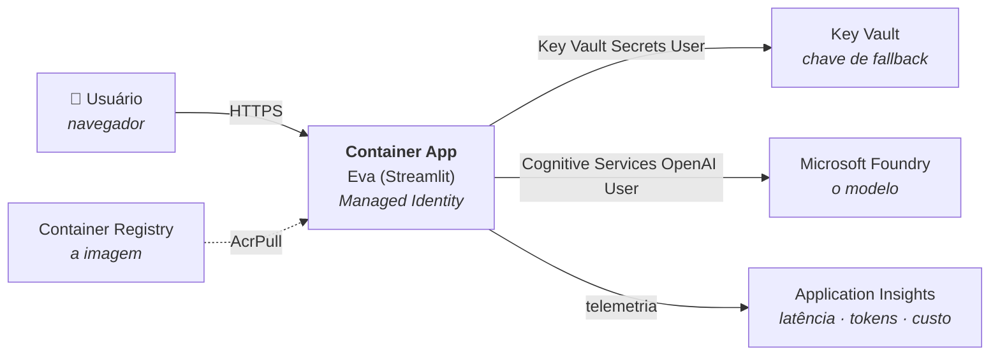

# Eva (Azure)

A Eva rodando **inteira no Azure**: aplicação em container no Azure Container
Apps, modelo no Microsoft Foundry, autenticação por **Managed Identity** (sem
chave), segredo de fallback no **Key Vault** e telemetria no **Application
Insights**.

> 📘 **Três caminhos para publicar, na ordem de aprendizado:**
>
> 1. [GUIA-DEPLOY-PORTAL.md](GUIA-DEPLOY-PORTAL.md) — clicando. Você vê o que
>    cada recurso é.
> 2. [GUIA-DEPLOY-CLI.md](GUIA-DEPLOY-CLI.md) — os mesmos recursos em ~20
>    comandos. Você vê como automatizar.
> 3. [GUIA-DEPLOY-TERRAFORM.md](GUIA-DEPLOY-TERRAFORM.md) — infraestrutura como
>    código, com `plan` antes de aplicar. Você vê como descrever.
>
> Nenhum substitui os outros: o portal é para entender e investigar incidente,
> a CLI para tarefa pontual, o Terraform para o que precisa durar e ser
> revisado em PR.

---

## A arquitetura



As três setas nomeadas são roles, não senhas. **Nenhum segredo trafega no
caminho feliz** — o container prova quem é, e cada recurso decide o que aquela
identidade pode fazer.

---

## Rodar na sua máquina

O mesmo código roda local, sem container:

```powershell
python -m venv .venv
.\.venv\Scripts\Activate.ps1
pip install -r requirements.txt
copy .env.example .env      # preencha endpoint e deployment
az login                    # a identidade vem daqui
python verificar.py
streamlit run app.py
```

`DefaultAzureCredential` usa a sessão do `az login` aqui e a Managed Identity
lá — mesmo código, dois ambientes. É por isso que "funciona na minha máquina"
deixa de ser um caminho diferente de "funciona em produção".

---

## O que mudou em relação à Eva-local-to-azure

| | local-to-azure | **azure** |
|---|---|---|
| Autenticação | chave no `.env` | **identidade**, chave só como fallback |
| Onde a chave mora | `.env` | **Key Vault** |
| Observabilidade | nenhuma | **Application Insights** por chamada |
| Empacotamento | nenhum | **Dockerfile** |
| Onde roda | sua máquina | **Azure Container Apps** |

O loop do agente, as ferramentas, o `agent.md` e o `memory.md` continuam
**idênticos aos da primeira Eva**. Cinco projetos depois, o núcleo não mudou.

---

## Arquivos

```text
Eva-azure/
├── eva.py                    # o agente (get_cliente agora é identidade-primeiro)
├── app.py                    # interface Streamlit
├── telemetria.py             # NOVO — Application Insights: latência, tokens, custo
├── verificar.py              # diagnóstico: conexão, identidade, telemetria
├── agent.md / memory.md      # inalterados
├── Dockerfile                # NOVO
├── .dockerignore             # NOVO — a primeira linha é `.env`
├── requirements.txt
├── .env.example              # só para rodar local
├── infra/deploy.ps1          # provisiona tudo por CLI
├── terraform/                # NOVO — a mesma infra declarada
│   ├── versions.tf           #   providers e versões
│   ├── variables.tf          #   entradas
│   ├── main.tf               #   os 17 recursos, com o porquê de cada decisão
│   ├── outputs.tf            #   URL, nomes e comandos prontos
│   └── terraform.tfvars.example
├── GUIA-DEPLOY-PORTAL.md     # passo a passo clicando
├── GUIA-DEPLOY-CLI.md        # passo a passo por comando
├── GUIA-DEPLOY-TERRAFORM.md  # passo a passo declarado
├── DIAGRAMAS.md              # C4 niveis 1 a 3 + observabilidade + sequencia
├── ANATOMIA-DO-HARNESS.md    # NOVO - o que existe entre o modelo e o mundo
├── LAB-OBSERVABILIDADE.md    # medir: KQL, iteracoes por turno, discrepancias
├── LAB-FINOPS.md             # decidir: custo por turno, as cinco alavancas
└── FinOps-na-Eva.pptx        # slides do bloco de FinOps em IA
```

**A ordem de leitura do material didatico**, depois de publicar:
`DIAGRAMAS.md` (como as pecas se organizam) -> `ANATOMIA-DO-HARNESS.md` (o que
cada peca faz, e o que o modelo NAO faz) -> `LAB-OBSERVABILIDADE.md` (medir) ->
`LAB-FINOPS.md` (decidir com o que foi medido).

> **Uma diferença que vale reparar:** o Terraform usa identidade
> **user-assigned**, e os outros dois usam **system-assigned**. Não é
> preferência — com system-assigned existe uma dependência circular que o
> modelo declarativo não resolve (o app precisa da role para nascer; a role
> precisa do ID que só existe depois de nascer). O guia do Terraform explica.

---

## Autenticação: identidade primeiro, chave se falhar

`get_cliente()` tenta nesta ordem:

1. **Identidade** — `DefaultAzureCredential`. No container é a Managed Identity;
   na sua máquina é o `az login`. Nenhum segredo em lugar nenhum.
2. **Chave** — só se a identidade falhar. Vem do Key Vault, entregue como
   variável de ambiente pelo Container Apps.

Quando o fallback entra em ação, a barra lateral mostra
**🔑 chave (FALLBACK — a identidade falhou)**. Isso é de propósito:

> Um fallback silencioso é pior que nenhum. A aplicação continuaria de pé com a
> Managed Identity quebrada, e ninguém saberia até o dia em que a chave também
> expirasse.

Para forçar a chave (só para depurar): `AZURE_FOUNDRY_AUTH=chave`.

---

## Telemetria

Cada chamada ao modelo vira um span `eva.chamada_modelo` com deployment,
duração, tokens e custo estimado, mais as métricas:

| Métrica | O que é |
|---|---|
| `eva.chamada.duracao` | histograma de latência (dá p50, p95) |
| `eva.tokens` | tokens de entrada e de saída |
| `eva.custo.estimado` | custo em USD |
| `eva.chamadas` | volume |

Sem `APPLICATIONINSIGHTS_CONNECTION_STRING`, tudo vira no-op — a aplicação roda
igual na sua máquina.

**O custo sai zerado** até você preencher `EVA_PRECO_ENTRADA_POR_1M` e
`EVA_PRECO_SAIDA_POR_1M` com os preços do seu modelo, na página de preços do
Azure. Deixei em zero de propósito: preço inventado em painel de custo é pior
que painel nenhum.

Um detalhe que costuma passar batido: chamada em **streaming** não reporta uso
de tokens por padrão. O código pede `stream_options={"include_usage": True}` —
sem isso, o painel de custo ficaria cego justamente no caminho que a interface
web usa.

---

## Publicar uma alteração

```powershell
az acr build --registry <seu-acr> --image eva:v2 .
az containerapp update -n eva-app -g rg-eva-azure --image "<seu-acr>.azurecr.io/eva:v2"
```

Tag nova a cada versão. Com `:latest`, o Container Apps pode não perceber que a
imagem mudou.

---

## Custo

- **Container App** com `--min-replicas 0` escala a zero: sem tráfego, sem custo
  de computação. O preço é o cold start de alguns segundos.
- **ACR Basic**, **Key Vault** e **Log Analytics** têm custo fixo pequeno, mas
  contínuo.
- O **modelo** é cobrado por token, no recurso do Foundry.

Ao fim da aula:

```powershell
az group delete --name rg-eva-azure --yes --no-wait
```

---

## O que ainda falta para chamar de produção

Honestamente, isto aqui é uma boa fundação, não um sistema pronto:

1. **Autenticação de usuário** — o ingress é público. Container Apps tem
   *Authentication* embutida (Entra ID) e resolve isso sem código.
2. **Rede privada** — hoje o tráfego para o Foundry sai pela internet.
   Private Endpoint fecha isso.
3. **Estado remoto do Terraform** — o `terraform.tfstate` fica na sua máquina e
   contém segredos em texto claro. Em uso real vai para um backend no Azure
   Storage, que dá criptografia, versionamento e lock entre pessoas.
4. **CI/CD** — build e deploy no GitHub Actions em vez de na sua máquina.
5. **Memória compartilhada** — `memory.md` vive no container e some a cada
   revisão. Precisa de Azure Files, Cosmos DB ou Blob.
6. **Testes** — nenhum.

O item 5 é o que quebra primeiro em uso real, e é o menos óbvio: a Eva "esquece"
tudo a cada deploy porque a memória está no sistema de arquivos de um container
efêmero.
