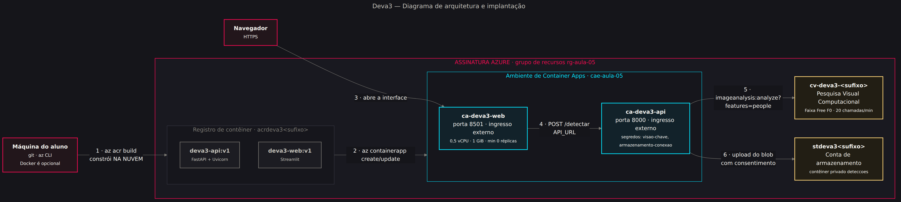

# Deva3 · API de Validação Biométrica Básica

> **FIAP · MBA AI Engineering & Multi-Agents · Cloud & Cognitive Environments · Aula 05**
> Prof. Isaias S. Britto · agosto de 2026

Um backend simples e isolado que recebe uma foto e devolve **as coordenadas das
detecções com a pontuação de confiança** do serviço cognitivo da Azure — mais uma
interface web para o aluno enviar a própria foto e ver o resultado na hora.

```
   foto  →  [ Streamlit ]  →  [ FastAPI ]  →  [ Azure AI Vision ]  →  JSON
                                    │
                                    └────────→  [ Blob Storage ]  (com consentimento)
```

> 🗺️ **Comece pelos diagramas.** Contexto, arquitetura e sequência estão em
> [`docs/00-diagramas.md`](docs/00-diagramas.md), com o fonte Mermaid editável em
> `docs/diagramas/`. Eles respondem, em três desenhos, com quem o sistema conversa,
> onde cada pedaço roda e o que acontece quando o aluno clica em "Analisar".



---

## O que ele faz — e o que não faz

**Faz:** recebe a imagem, chama o **Azure AI Vision · Image Analysis 4.0**
(`features=people`), devolve `boundingBox` + `confidence`, desenha a caixa sobre a foto
e guarda imagem e resultado no Blob quando há consentimento. Opcionalmente usa o
**Azure AI Face**, quando a assinatura tem o recurso aprovado.

**Não faz, e isso é decisão de projeto:** não identifica ninguém, não compara rostos,
não guarda template biométrico e não infere idade, gênero ou emoção.

---

## Começar em 3 minutos (local)

```bash
git clone https://github.com/IsaiasBritto/aie-cloud.git
cd aie-cloud/aulas/05-foundry-agents/Lab
cp .env.exemplo .env          # preencha VISAO_ENDPOINT e VISAO_CHAVE
docker compose up --build
```

- Interface ......... http://localhost:8501
- API ............... http://localhost:8000
- Documentação ...... http://localhost:8000/docs
- Saúde ............. http://localhost:8000/saude

Sem Docker:

```bash
python -m venv .venv && source .venv/bin/activate
make instalar
make api      # em um terminal
make web      # em outro
```

---

## O endpoint

```http
POST /detectar?modo=pessoas&consentimento=true
Content-Type: multipart/form-data

imagem: <arquivo JPEG/PNG/BMP/WEBP, até 4 MB>
```

Resposta (recortada):

```json
{
  "identificador": "9f2c41ab77de",
  "modo": "pessoas",
  "servico": "Azure AI Vision · Image Analysis 4.0 (features=people)",
  "dimensoes": { "largura": 1280, "altura": 960 },
  "limiar_confianca": 0.6,
  "total_detectado": 2,
  "total_acima_do_limiar": 1,
  "deteccoes": [
    {
      "indice": 1,
      "caixa": { "x": 412, "y": 96, "largura": 288, "altura": 640 },
      "confianca": 0.947,
      "acima_do_limiar": true,
      "proporcao_da_imagem": 0.15
    }
  ],
  "duracao_ms": 412,
  "imagem_persistida": true,
  "caminho_blob": "deteccoes/2026/08/30/9f2c41ab77de",
  "avisos": []
}
```

Erros saem sempre no mesmo formato, com o campo que resolve a dúvida:

```json
{
  "erro": "servico_nao_configurado",
  "mensagem": "O serviço Azure AI Face não está configurado nesta instância.",
  "detalhe": null,
  "como_resolver": "Use ?modo=pessoas, que funciona com qualquer chave de Vision."
}
```

### Os dois modos

| | `modo=pessoas` (padrão) | `modo=rostos` |
|---|---|---|
| Serviço | Azure AI Vision · Image Analysis 4.0 | Azure AI Face · `/face/v1.2/detect` |
| Precisa de aprovação? | **Não** | **Sim** — Acesso Limitado |
| Devolve confiança? | **Sim**, 0 a 1 | **Não.** Derivamos de `qualityForRecognition` |
| O que a caixa cerca | a pessoa | o rosto |
| Quando usar | sempre, em aula | só com recurso aprovado |

---

## Estrutura

```
aulas/05-foundry-agents/Lab/
├── AGENTS.md              A alma do agente (leia primeiro)
├── MEMORY.md              O que já foi aprendido — lido no início de toda sessão
├── api/                   Backend FastAPI
│   ├── principal.py       Rotas: / · /saude · /detectar
│   ├── configuracao.py    Variáveis de ambiente
│   ├── modelos.py         Contrato de dados
│   ├── erros.py           Erros com "como_resolver"
│   ├── servicos/          Uma classe por integração
│   └── testes/            15 testes, sem rede
├── web/aplicacao.py       Interface Streamlit
├── infra/                 Scripts az CLI + Bicep
├── agente/                Artefatos do agente
│   └── skills/            Três procedimentos salvos (SKILL.md)
└── docs/
    ├── 00-diagramas.md    Contexto · arquitetura · sequência
    ├── 01-manual-portal.md
    ├── 02-manual-script.md
    ├── 03-passo-a-passo-do-zero.md
    ├── diagramas/         Fonte Mermaid (.mmd) + tema FIAP
    └── imagens/           Os PNG gerados
```

Todo identificador que **nós** criamos está em português. Ficam em inglês apenas as
bibliotecas, os campos que a Azure devolve (`boundingBox`, `faceRectangle`) e os termos
de infra consagrados (Dockerfile, Blob, Container App).

---

## Publicar na Azure

Antes de abrir o portal, veja os desenhos:

- **Os três diagramas** → [`docs/00-diagramas.md`](docs/00-diagramas.md)

Duas trilhas, mesmo resultado:

- **Pelo portal, tela a tela** → [`docs/01-manual-portal.md`](docs/01-manual-portal.md)
- **Por script (`az` + Bicep)** → [`docs/02-manual-script.md`](docs/02-manual-script.md)

Como o projeto foi construído, passo a passo →
[`docs/03-passo-a-passo-do-zero.md`](docs/03-passo-a-passo-do-zero.md)

Resumo da trilha por script:

```bash
export SUFIXO=fiap01
bash infra/01-criar-recursos.sh     # rg-aula-05, storage+blob, visão, ACR, ambiente
bash infra/02-publicar-imagens.sh   # az acr build das duas imagens
bash infra/03-implantar-apps.sh     # ca-deva3-api + ca-deva3-web
# ... aula ...
bash infra/99-remover-tudo.sh       # apaga o grupo inteiro
```

### Recursos criados

| Recurso | Nome | Para quê |
|---|---|---|
| Grupo de recursos | `rg-aula-05` | A pasta que apaga tudo de uma vez |
| Conta de armazenamento | `stdeva3<sufixo>` | Container privado `deteccoes` |
| Visão computacional | `cv-deva3-<sufixo>` | O cérebro (F0 gratuito) |
| Registro de containers | `acrdeva3<sufixo>` | Guarda as duas imagens |
| Ambiente de Container Apps | `cae-aula-05` | Onde os apps rodam |
| Container App · API | `ca-deva3-api` | Porta 8000 |
| Container App · interface | `ca-deva3-web` | Porta 8501 |

---

## Privacidade — leia antes de subir foto de alguém

Imagem de rosto é **dado pessoal sensível** (LGPD, art. 5º, II — dado biométrico).
Este projeto foi desenhado para ensinar isso, não para contorná-lo:

- a interface pede **consentimento explícito** antes de gravar a imagem;
- sem consentimento, apenas o **JSON do resultado** é gravado;
- `PERSISTIR_IMAGENS=false` desliga a gravação por completo;
- o container do Blob é **privado**, sem acesso anônimo;
- o laboratório termina com `az group delete` — retenção do dado da aula é **o tempo
  da aula**;
- nenhuma foto entra no repositório: o `.gitignore` bloqueia `*.jpg` e `*.png`.

O próprio portal da Azure avisa, na tela de criação do recurso de visão, que o serviço
processa **Dados Biométricos** e que **o cliente é responsável** por cumprir as
obrigações do DPA. Quem clica em "aceito" é você.

---

## Testes

```bash
python -m pytest          # 15 testes, nenhum toca a rede
```

Eles usam payloads reais copiados da documentação da Azure e cobrem a interpretação dos
dois formatos, a ordenação por confiança, a validação da imagem e a regra do limiar.

---

## A ideia central da aula

> **Confiança não é acurácia.**

O serviço pode acertar com confiança baixa e errar com confiança alta. Onde colocar o
limiar é uma **decisão de risco** — e quem decide é quem responde pelo processo, não
quem escreve o código.

Por isso o limiar é configurável (`LIMIAR_CONFIANCA`), aparece no payload, aparece na
tela, e a interface pinta em cores diferentes o que está acima e abaixo dele.

---

*Uso exclusivo para fins acadêmicos.*
